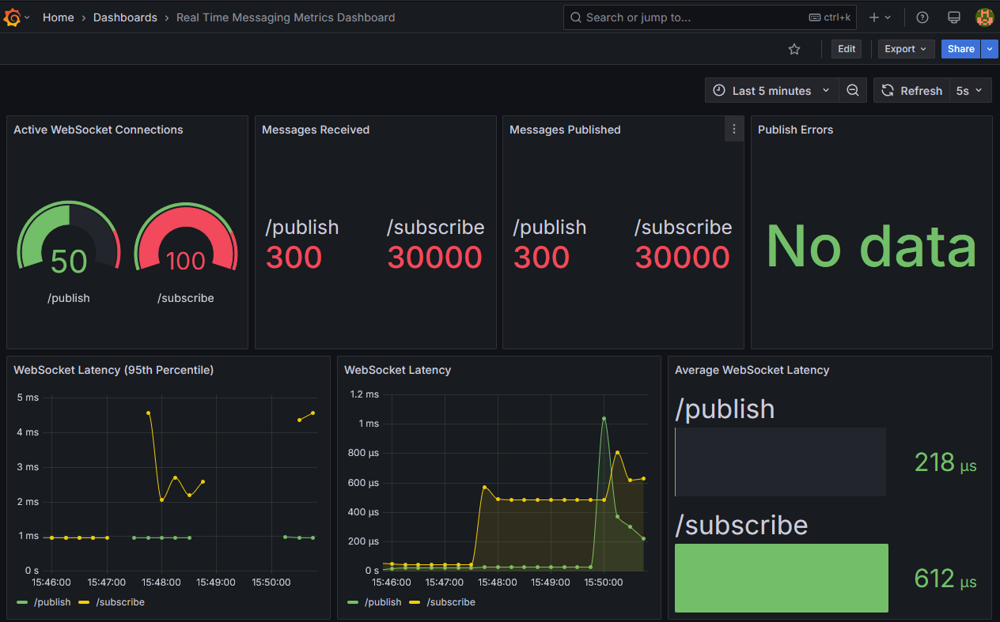

# realtime-messaging
Real time pubsub messaging with Golang and Websockets

This Project has a CI workflow for testing each [PR](https://github.com/iulian509/realtime-messaging/pulls?q=is%3Apr+is%3Aclosed)

## Project structure
```
.
├── LICENSE
├── README.md
├── auth-cli                        # CLI tool to generate JWT tokens to authenticate each WebSocket connection
│   └── main.go
├── demo                            # CLI tool with a basic demo that shows how everything works automatically
│   └── main.go
├── docker                          # Docker configuration of each CLI tool and microservice
│   ├── auth-cli
│   │   └── Dockerfile
│   ├── demo
│   │   └── Dockerfile
│   ├── publisher
│   │   └── Dockerfile
│   └── subscriber
│       └── Dockerfile
├── docker-compose.yml              # Docker Compose configuration for running all the services
├── go.mod
├── go.sum
├── grafana                         # Grafana and dashboard configuration
│   ├── dashboards
│   │   └── dashboard.json
│   └── provisioning
│       ├── dashboards
│       │   └── dashboard.yml
│       └── datasources
│           └── datasource.yml
├── internal                        # Internal package with shared logic used in both microservices and tools
│   ├── auth                        # Authentication middleware for both microservices
│   │   └── auth.go
│   ├── config                      # Load needed configuration from a YAML file
│   │   ├── config-dev.yml
│   │   └── config.go
│   ├── metrics                     # Prometheus middleware
│   │   └── metrics.go
│   └── websocket                   # Ping Pong hearbeat for checking the status with the client's connection
│       └── heartbeat.go
├── prometheus.yml                  # Prometheus scrapper configuration
├── publisher                       # Publisher microservice
│   ├── cmd                         # Publisher microservice entrypoint
│   │   └── publisher
│   │       └── main.go
│   └── internal                    # Publisher microservice internal packages
│       ├── handlers                # Publisher microservice handler logic
│       │   ├── dependencies.go
│       │   ├── publisher.go
│       │   └── publisher_test.go
│       └── mq                      # Publisher microservice message queue (NATS) logic
│           ├── publisher.go
│           └── publisher_test.go
└── subscriber                      # Subscriber microservice
    ├── cmd                         # Subscriber microservice entrypoint
    │   └── subscriber
    │       └── main.go
    └── internal                    # Subscriber microservice internal packages
        ├── handlers                # Subscriber microservice handler logic
        │   ├── dependencies.go
        │   ├── subscriber.go
        │   └── subscriber_test.go
        └── mq                      # Subscriber microservice message queue (NATS) logic
            ├── subscriber.go
            └── subscriber_test.go
```

### Build and run the project
```
docker compose up --build
```

### Obtain a JWT token
```
docker compose run auth-cli /app/auth-cli-bin -action create -username demo-user
```

### Connect to the services to start playing

Using websocat for the example but you can use any other tool of your preference
```
websocat ws://localhost:3000/publish -H "Authorization: Bearer {JTW_TOKEN}"

websocat ws://localhost:3001/subscribe -H "Authorization: Bearer {JTW_TOKEN}"
```

### To access metrics dashboard click in the following link: [Metrics Dashboard](http://localhost:3002/d/realtime-metrics-dashboard)



### Demo

Build and run the project:
```
docker compose up --build
```

##### Obtain a JWT token and run demo container

Linux:
```
JWT_TOKEN=$(docker compose run --rm auth-cli /app/auth-cli-bin -action create -username demo-user | grep "generated JWT" | awk -F': ' '{print $2}') && docker compose run --rm -e JWT_TOKEN="$JWT_TOKEN" demo /app/demo-bin
```

Windows Powershell:
```
$JWT_TOKEN = (docker compose run --rm auth-cli /app/auth-cli-bin -action create -username demo-user | Select-String "generated JWT" | ForEach-Object { $_.Line -replace ".*: ", "" }); docker compose run --rm -e JWT_TOKEN=$JWT_TOKEN demo /app/demo-bin
```
